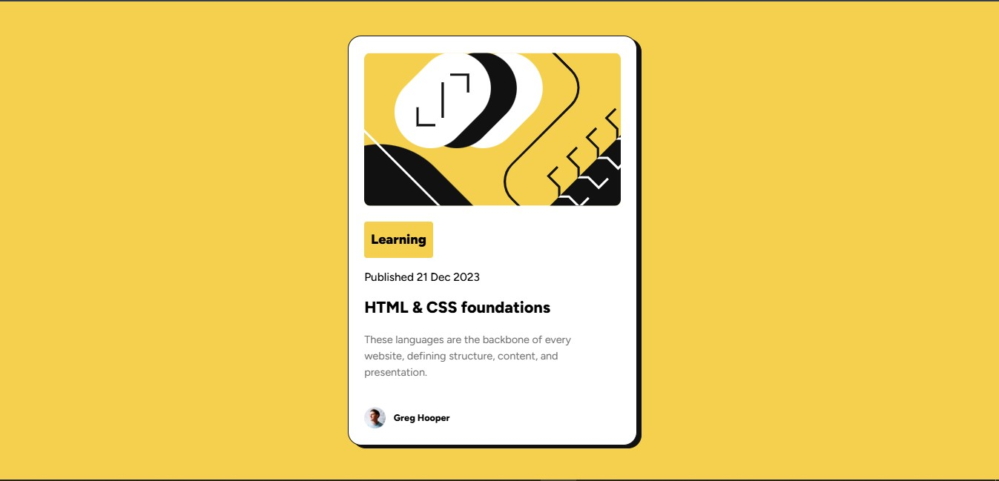
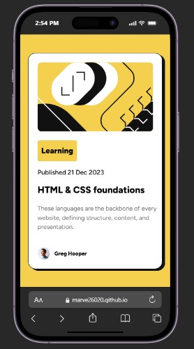

# Frontend Mentor - Blog preview card solution

This is a solution to the [Blog preview card challenge on Frontend Mentor](https://www.frontendmentor.io/challenges/blog-preview-card-ckPaj01IcS). Frontend Mentor challenges help you improve your coding skills by building realistic projects. 

## Table of contents

- [Overview](#overview)
  - [The challenge](#the-challenge)
  - [Screenshot](#screenshot)
  - [Links](#links)
- [My process](#my-process)
  - [Built with](#built-with)
  - [What I learned](#what-i-learned)
  - [Continued development](#continued-development)
  - [Useful resources](#useful-resources)
  - [AI Collaboration](#ai-collaboration)
- [Author](#author)
- [Acknowledgments](#acknowledgments)


## Overview

### The challenge

Users should be able to:

- See hover and focus states for all interactive elements on the page

### Screenshot
**Desktop View**


**Mobile View**



### Links
- Live Site URL: [Blog preview live site](https://marve26020.github.io/blog-preview-card/)

## My process

### Built with

- Semantic HTML5 markup
- CSS custom properties
- CSS variables
- CSS media query
- Flexbox
- CSS Grid

### What I learned
* When styling text in CSS, it is essential to implement **font fallbacks**. 
Providing fallback options ensures that if a browser fails to load your primary custom font due to network issues or compatibility problems, it will automatically downgrade to a specified alternative. This prevents the text from defaulting to a generic, unstyled system font, thereby maintaining the integrity and visual consistency of your user interface.
```CSS
  --text-font: "Figtree", Arial, sans-serif;
```
* I learnt that CSS now supports a cleaner, mathematical approach to writing responsive breakpoints using **comparison operators** (like `<=`, `>=`, `<`, and `>`). This modern **Range Syntax** replaces the traditional, more verbose `min-width` and `max-width` properties, making responsive styles much easier to read and maintain.

```css
/* Modern Syntax (Width is less than or equal to 480px) */
@media (width <= 480px) {
  /* Your mobile styles here */
}

/* Traditional Equivalent */
@media (max-width: 480px) {
  /* Your mobile styles here */
}
```
* The CSS `drop-shadow()` function applies a shadow effect that conforms precisely to the **outline of an element or graphic**, rather than just its bounding box. This function accepts **three or four length values**, followed by an optional color, to control how the shadow is positioned and styled:


```css
/* Example using 3 values (X-offset, Y-offset, Blur, Color) */
.icon {
  filter: drop-shadow(4px 4px 10px rgba(0, 0, 0, 0.5));
}
```

### Useful resources

- [MDN drop-shadow()](https://developer.mozilla.org/en-US/docs/Web/CSS/Reference/Values/filter-function/drop-shadow) - This helped me in my understanding of the drop-shadow effect. I really liked this pattern and will use it going forward.

### AI Collaboration

Throughout the development of this project, I integrated **Google Gemini** into my workflow as a primary technical resource. Leveraging the AI allowed me to:

* **Deepen CSS Knowledge:** I quickly researched complex layout techniques, modern syntax, and specific CSS property behaviors.
* **Optimize Git Practices:** I learned how to structure semantic, clear, and standardized commit messages.
* **Accelerate Conceptual Learning:** It served as a reliable guide for breaking down advanced web development concepts into easily digestible explanations.


## Author

- Website - [Okoli Marvellous Chidera](https://marve26020.github.io/Profile_Card/)
- Frontend Mentor - [@marve26020](https://www.frontendmentor.io/profile/marve26020)

## Acknowledgments

I sincerely want to thank [Frontend Mentor](https://www.frontendmentor.io) platform for this opportunity to mark this   [project](https://marve26020.github.io/qr-code/)  and also providing me with professional tools like the figma design and other useful items. 
